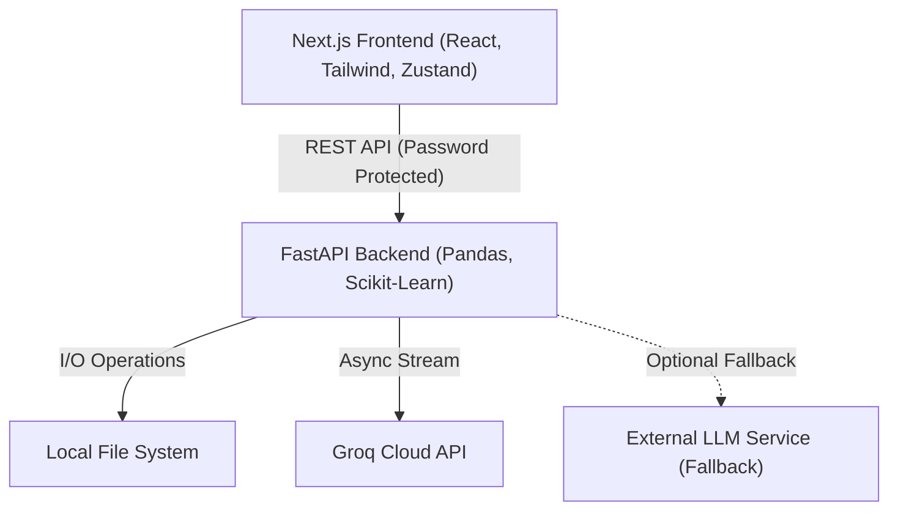

# AI Data Science Copilot

A full-stack web application designed to automate and assist in the exploratory data analysis (EDA), preprocessing, and feature engineering of tabular datasets. 

This tool serves as an intelligent copilot for data scientists, providing immediate statistical insights, interactive visualizations, and a context-aware AI chat assistant that can reason about your specific dataset.

## Capabilities

* **Automated EDA**: Upload any CSV to immediately generate comprehensive summary statistics, schema definitions, and feature distributions.
* **Intelligent Preprocessing**: Handle missing values (imputation, dropping rows/columns), encode categorical variables (One-Hot, Ordinal, Label), and scale numerical features (Standard, MinMax, Robust).
* **Feature Engineering Pipeline**: Chain together multiple transformations including Mathematical operations, Binning, Polynomial features, and Logarithmic transforms to create predictive signals.
* **Outlier & Correlation Analysis**: Automatically detect statistical outliers using the IQR method and compute correlation matrices to identify multicollinearity.
* **Custom Visualizations**: Build dynamic, interactive charts (Scatter, Line, Histogram, KDE, Box, Violin) using an integrated Plotly engine.
* **Contextual UI**: Highlights missing data percentage and datatypes for affected columns when performing imputation operations.
* **Context-Aware AI Assistant**: A conversational interface powered natively by the **Groq Cloud API** (`llama-3.3-70b-versatile`) with a dual-model fallback mechanism (`17b-scout`) to handle rate limits. Protected via backend password validation for secure deployments.
* **State Management & Persistence**: Undo/Redo capabilities for dataset transformations. Preprocessing and feature engineering pipelines are persisted via local storage (Zustand) across tabs.
* **Export**: Download your cleaned and engineered dataset at any point in the pipeline.

## Architecture

The system follows a decoupled client-server architecture, relying on a localized file storage system for dataset persistence and the Groq Cloud API for Large Language Model (LLM) inference.



* **Frontend**: Built with Next.js (App Router), React, and Tailwind CSS. Client-side state (including pipelines and transformation history) is persisted via Zustand. Visualizations are rendered using Plotly.js.
* **Backend**: Built with FastAPI and Python. It handles heavy computations utilizing Pandas and Scikit-Learn. The backend also handles secure password-based authentication for the AI endpoints to prevent abuse.
* **LLM Integration**: The AI assistant communicates natively with the Groq API via the official Python SDK, featuring a dual-model rate-limit fallback hierarchy. The original external LLM Wrapper service remains supported as a configurable fallback option.

## Prerequisites

Before running this project, ensure you have the following installed:
* Node.js (v18 or higher)
* Python (3.9 or higher)
* A [Groq Cloud](https://console.groq.com/) API Key for the AI Copilot.

## Environment Setup

Before running the application, you need to configure the environment variables for both the backend and frontend. We have provided template files to make this easy.

### 1. Backend Environment
Navigate to the `backend/` directory and copy the example file:
```bash
cd backend
cp .env.example .env
```
Open `backend/.env`. For local development, set:
*   `ENVIRONMENT=local`
*   `MONGODB_URI=mongodb://localhost:27017`
*   `LLM_PROVIDER=groq`
*   `GROQ_API_KEY=your_groq_api_key`
*   `ASSISTANT_PASSWORD=any_password_you_want`

### 2. Frontend Environment
Navigate to the `frontend/` directory and copy the example file:
```bash
cd frontend
cp .env.example .env.local
```
Open `frontend/.env.local`. For local development, use the defaults:
*   `NEXT_PUBLIC_BACKEND_URL=http://localhost:8000`
*   `NEXT_PUBLIC_MAX_UPLOAD_MB=50` (Protects the server against out-of-memory errors).

## Installation & Running the Project

### 1. Start the Backend (FastAPI)

Open a terminal window and navigate to the backend directory.

```bash
cd backend
```

Create and activate a virtual environment:
```bash
python -m venv .venv

# On Windows:
.venv\Scripts\activate
# On macOS/Linux:
source .venv/bin/activate
```

Install the required Python dependencies:
```bash
pip install -r requirements.txt
```

Start the FastAPI server:
```bash
uvicorn main:app --reload --port 8000
```
The backend will now be running at `http://localhost:8000`.

### 2. Start the Frontend (Next.js)

Open a second terminal window and navigate to the frontend directory.

```bash
cd frontend
```

Install the Node dependencies:
```bash
npm install
```

Start the development server:
```bash
npm run dev
```
The frontend will now be running at `http://localhost:3000`. 

## Deployment (Production)

We recommend deploying the frontend to **Vercel** and the backend to **Render**.

### Backend (Render)
1. Push your code to GitHub.
2. Go to [Render](https://render.com/) and create a new **Web Service**.
3. Connect your GitHub repository.
4. Set the Start Command: `uvicorn main:app --host 0.0.0.0 --port $PORT`
5. Add your Environment Variables:
   *   `ENVIRONMENT`: `production` (Bypasses MongoDB and uses localized JSON file storage)
   *   `LLM_PROVIDER`, `GROQ_API_KEY`, `ASSISTANT_PASSWORD`
6. Deploy! Copy your live Render URL (e.g., `https://automl-api.onrender.com`).

*Note: The frontend includes a loader to handle Render's free-tier sleep cycles.*

### Frontend (Vercel)
1. Go to [Vercel](https://vercel.com/) and Import your GitHub repository.
2. Set the Framework Preset to Next.js.
3. Set the Root Directory to `frontend`.
4. In Environment Variables, add:
   *   `NEXT_PUBLIC_BACKEND_URL`: Paste your live Render URL here.
   *   `NEXT_PUBLIC_MAX_UPLOAD_MB`: `50` (or your preferred size).
5. Deploy!

## Usage

1. Open your live Vercel URL (or `http://localhost:3000` if running locally).
2. Upload a valid `.csv` file.
3. Use the sidebar navigation to explore features, handle missing data, engineer new columns, and view visualizations.
4. Navigate to the "AI Assistant" tab, enter your `ASSISTANT_PASSWORD` to unlock it, and chat with the LLM about your active dataset.
5. Click "Export CSV" at any time in the sidebar to download your processed data.
