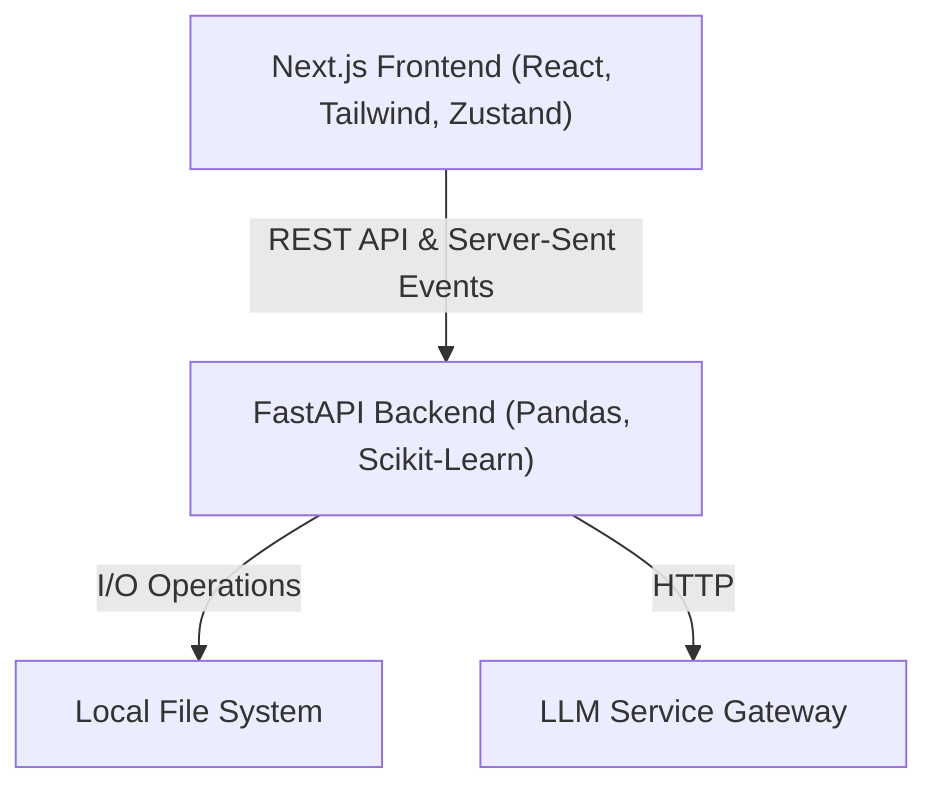

# AI Data Science Copilot

A full-stack web application designed to automate and assist in the exploratory data analysis (EDA), preprocessing, and feature engineering of tabular datasets. 

This tool serves as an intelligent copilot for data scientists, providing immediate statistical insights, interactive visualizations, and a context-aware AI chat assistant that can reason about your specific dataset.

## Capabilities

* **Automated EDA**: Upload any CSV to immediately generate comprehensive summary statistics, schema definitions, and feature distributions.
* **Intelligent Preprocessing**: Handle missing values (imputation, dropping rows/columns), encode categorical variables (One-Hot, Ordinal, Label), and scale numerical features (Standard, MinMax, Robust).
* **Feature Engineering Pipeline**: Chain together multiple transformations including Mathematical operations, Binning, Polynomial features, and Logarithmic transforms to create predictive signals.
* **Outlier & Correlation Analysis**: Automatically detect statistical outliers using the IQR method and compute correlation matrices to identify multicollinearity.
* **Custom Visualizations**: Build dynamic, interactive charts (Scatter, Line, Histogram, KDE, Box, Violin) using an integrated Plotly engine.
* **Context-Aware AI Assistant**: A conversational interface that understands your dataset's exact schema, statistics, and distributions, allowing you to ask complex analytical questions in natural language.
* **State Management**: Undo/Redo capabilities for all dataset transformations, ensuring you can experiment safely.
* **Export**: Download your cleaned and engineered dataset at any point in the pipeline.

## Architecture

The system follows a modern decoupled client-server architecture, relying on a localized file storage system for dataset persistence and an external gateway for Large Language Model (LLM) inference.



* **Frontend**: Built with Next.js (App Router), React, and Tailwind CSS. Client-side state (including the active dataset summary and transformation history) is managed via Zustand. Visualizations are rendered using Plotly.js.
* **Backend**: Built with FastAPI and Python. It handles all heavy computational tasks utilizing Pandas for data manipulation and Scikit-Learn for preprocessing algorithms. 
* **LLM Service**: The AI assistant capabilities are powered by a custom LLM API Wrapper. The backend communicates with this service and streams the generated tokens back to the frontend client.

## Prerequisites

Before running this project, ensure you have the following installed:
* Node.js (v18 or higher)
* Python (3.9 or higher)
* The LLM API Wrapper service running locally.

### Setting up the LLM Service
This project requires the external LLM Service to function. Clone and start the service by following the instructions in its repository:
[https://github.com/Siddharth-Jaswal/LLM-SERVICE](https://github.com/Siddharth-Jaswal/LLM-SERVICE)

Ensure the LLM service is actively running (default port is usually 9000).

## Environment Variables

### Backend
Navigate to the `backend/` directory and create a `.env` file. You need to provide the URL where your LLM service is hosted.

```env
# backend/.env
LLM_GATEWAY_URL=http://localhost:9000
```

## Installation & Running the Project

### 1. Start the Backend (FastAPI)

Open a terminal window and navigate to the backend directory.

```bash
cd backend
```

Create and activate a virtual environment:
```bash
python -m venv .venv

# On Windows:
.venv\Scripts\activate
# On macOS/Linux:
source .venv/bin/activate
```

Install the required Python dependencies:
```bash
pip install -r requirements.txt
```

Start the FastAPI server:
```bash
uvicorn main:app --reload --port 8000
```
The backend will now be running at `http://localhost:8000`.

### 2. Start the Frontend (Next.js)

Open a second terminal window and navigate to the frontend directory.

```bash
cd frontend
```

Install the Node dependencies:
```bash
npm install
```

Start the development server:
```bash
npm run dev
```
The frontend will now be running at `http://localhost:3000`. 

## Usage

1. Open `http://localhost:3000` in your browser.
2. Upload a valid `.csv` file.
3. Use the sidebar navigation to explore features, handle missing data, engineer new columns, and view visualizations.
4. Navigate to the "AI Assistant" tab to chat with the LLM about your active dataset.
5. Click "Export CSV" at any time in the sidebar to download your processed data.
